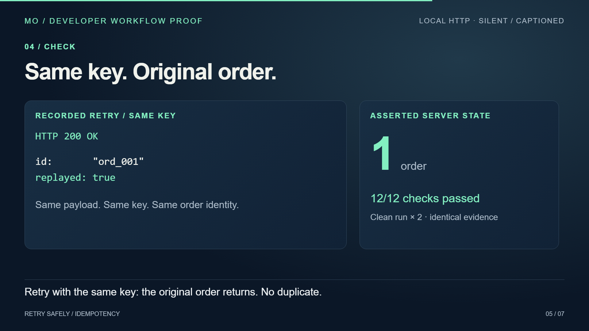

# Retry safely: an executable HTTP tutorial

A 60-second Remotion explanation of a lost HTTP response, an unsafe retry, and a checked idempotency fix. Original synthetic data, real local HTTP requests, and recorded outputs reused in the video.

[Watch or download the silent captioned MP4](media/retry-proof.mp4) · [QA record](QA.md)



## Run it

Requires Node with built-in `fetch`; tested with Node **24.19.0** on Windows. The HTTP example needs no installation, credentials, or external service.

```sh
node example/run.mjs
node scripts/verify-clean.mjs
```

The server commits the first order and intentionally drops its response. An unkeyed retry creates another order; a retry with the original key returns the stored order. Reusing that key with a changed payload is rejected.

```text
First call: fetch failed; stored orders = 1
No key retry: HTTP 201; ord_002; stored orders = 2
Same key retry: HTTP 200; ord_001; replayed = true; stored orders = 1
Changed payload, same key: HTTP 409; key_payload_conflict; stored orders = 1
12/12 checks passed
```

`evidence/execution.json` contains these actual results and the SDK excerpt read from the executed source. The composition imports that evidence. Clean verification copies only the three example files into a fresh directory, runs twice, and compares the results with the evidence used in the video.

## Re-render

Locked toolchain: Remotion **4.0.438**, React **19.2.3**, TypeScript **5.9.3**; tested with npm **11.17.0**. The original render used an existing local installation and cached Chromium. Fresh dependency and browser installation are untested.

```sh
npm ci
npm run check
npm run render
npm run qa
```

The render script uses Remotion's Windows cached Chromium path. If absent, run `npx remotion browser ensure` or set the browser path to an existing Chromium executable. Rendered outputs are written under `out/`; the delivered video and preview are under `media/`.

## Educational scope

This is a **sequential-retry, single-process, in-memory teaching example**, not complete production-safe payment processing. A header alone provides no guarantee: the server must implement idempotency. Production needs atomic durable storage, operation-scoped keys, payload matching, authorization, retention and a defined retry/replay contract. The fixed example key is only for reproducibility. This synthetic service returns 200 for a replay and 201 for a new order; it does not implement any vendor's complete API.

The topic is relevant to SDK integration tutorials; see [Stripe's idempotent-request guide](https://docs.stripe.com/api/idempotent_requests). No buyer-conversion or production-readiness claim is made.

All example code, writing, layout and captions are original. The video is intentionally silent, with no narration or music. System fonts are rendered into the video; no font files, dependencies or browser binaries are redistributed. Existing package rights and dependency licenses are unchanged; no new license is granted by publication.
